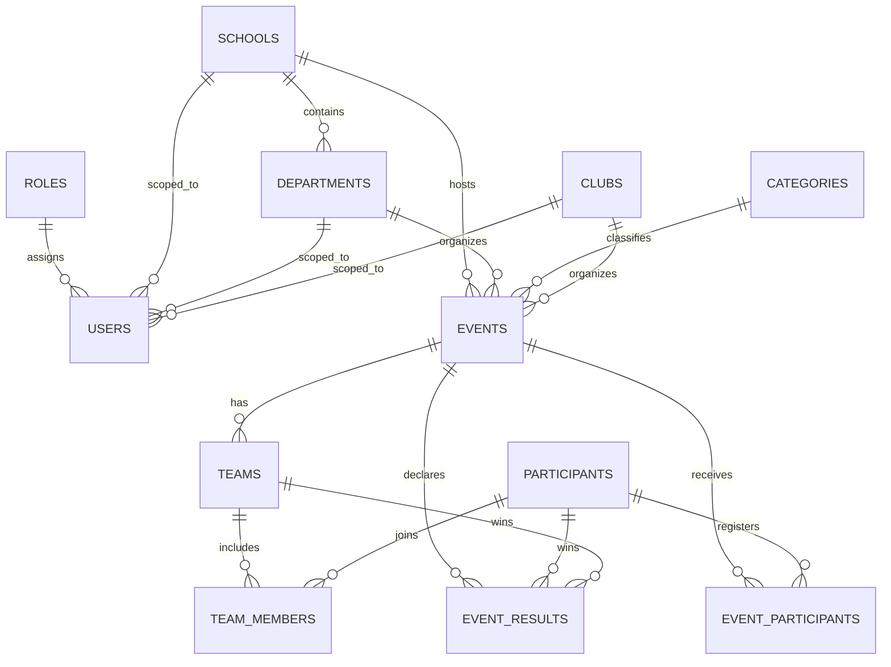

# College Event Statistics Portal

Mini Project - Data Analytics & Visualization

## Project Overview

The College Event Statistics Portal centralizes event data from departments and clubs into a single system.  
It supports event data entry, participant and result tracking, analytics queries, and dashboard-driven insights for management, faculty, and students.

## Core Features

- Role-based portal (`Student`, `Organizer`, `Admin`)
- Data Entry Portal for:
  - event creation
  - participant registration
  - competition result logging
- Event listing with filters:
  - date range
  - category
  - department
- Student view:
  - upcoming events
  - past participation
  - result history
- Analytics/Reports:
  - top performers
  - active clubs
  - category and monthly trends
- Public intercollege registration for selected events

## Tech Stack

- **Frontend**: React + Vite
- **Database**: PostgreSQL (Supabase)
- **Data Processing**: Python (Pandas + Supabase client)
- **Visualization**: Python-generated charts (Flask + Matplotlib/Seaborn) embedded in React
- **Deployment-ready**: Works with cloud DB + cloud frontend hosting

## Architecture

- Frontend application calls Supabase directly for CRUD and analytics display.
- PostgreSQL stores normalized raw transactional data (`events`, `participants`, `event_participants`, `event_results`, etc.).
- Python processing pipeline:
  - reads raw tables
  - performs cleaning and standardization
  - computes derived metrics
  - exports deterministic analytical snapshots
- Optional derived SQL schema (`derived_schema.sql`) defines separate aggregate tables.

## ER Diagram (Text Form)



## Database Setup

Run SQL scripts in your cloud PostgreSQL (Supabase SQL editor) in this order:

1. `01_schema_and_data.sql` (Creates core tables, constraints, inserts seed data, and adds permissive RLS policies)
2. `02_analytics_and_views.sql` (Creates derived tables for analytics and dashboard SQL views)

*(Note: The previous fragmented scripts like update_schema.sql and fix_rls.sql have been consolidated into these two files for simplicity).*

## Analytical Queries

`analytical_queries.sql` contains at least 5 meaningful queries for:

- department-wise event and participation metrics
- internal vs external participation
- monthly trend analysis
- top performers
- active clubs by event count and footfall

## Python Processing Pipeline

Path: `python_scripts/data_processing.py`

What it does:

- fetches raw data from Supabase
- cleans nulls/duplicates/inconsistent categorical values
- standardizes fields
- computes derived metrics:
  - events per department
  - participation metrics and external ratio
  - top performers
  - monthly event frequency
- writes repeatable output snapshots to:
  - `python_scripts/processed_output/department_metrics.json`
  - `python_scripts/processed_output/participation_metrics.json`
  - `python_scripts/processed_output/top_performers.json`
  - `python_scripts/processed_output/monthly_frequency.json`
  - `python_scripts/processed_output/run_metadata.json`

## Environment Variables

### Frontend (`frontend/.env`)

```env
VITE_SUPABASE_URL=your_supabase_project_url
VITE_SUPABASE_PUBLISHABLE_KEY=your_supabase_anon_key
VITE_API_BASE_URL=http://127.0.0.1:5000
```

### Python

```env
SUPABASE_URL=your_supabase_project_url
SUPABASE_KEY=your_supabase_service_role_key
```

## Run Frontend Locally

```bash
cd frontend
npm install
npm run dev
```

The frontend reads Python chart images from `VITE_API_BASE_URL`.  
For local development, keep this set to `http://127.0.0.1:5000` and run the Flask chart service.

## Run Python Chart API

Install dependencies and start the analytics server:

```bash
cd python_scripts
pip install -r requirements.txt
python app.py
```

## Run Python Processing

Install dependencies and execute:

```bash
pip install pandas supabase
cd python_scripts
python data_processing.py
```

## Deliverables Mapping

- **Working web portal**: `frontend/`
- **Database schema + normalization**: `schema.sql` (+ updates)
- **ER diagram**: included in this README
- **Analytical SQL queries**: `analytical_queries.sql`
- **Python scripts**: `python_scripts/data_processing.py`
- **Visualization dashboard**: `frontend/src/pages/Dashboard.jsx`, `frontend/src/pages/Reports.jsx`
- **Cloud-ready configuration**: Supabase client + env-based credentials

## Deployment Notes

- Host frontend on Render/Vercel/Netlify (free tier).
- Deploy the Python chart API (`python_scripts/app.py`) on a backend host such as Render/Railway.
- Set `VITE_API_BASE_URL` in the frontend deployment to the deployed Flask backend URL.
- Use Supabase/Neon/Railway PostgreSQL as cloud DB.
- Keep credentials in platform environment variables (never hardcode keys).
- Configure SPA route rewrites so routes like `/events`, `/reports`, and `/analytics` resolve to `index.html`.
- The current login system is suitable for demo/project deployment, but for real production security it should be replaced with Supabase Auth or a secure backend-auth flow.
- Add deployment URL and usage instructions in this README before final submission.
